# Parallaxr CI/CD and Test Automation Framework
## HiveMind-Tester-Delta Automated Quality Assurance Pipeline

### Overview
This document outlines a comprehensive continuous integration and continuous deployment (CI/CD) framework for the Parallaxr project, including automated testing, quality gates, and deployment strategies.

## CI/CD Architecture

### Pipeline Overview

```mermaid
graph LR
    A[Code Push] --> B[Pre-commit Hooks]
    B --> C[CI Pipeline Start]
    C --> D[Environment Setup]
    D --> E[Dependency Installation]
    E --> F[Code Quality Checks]
    F --> G[Unit Tests]
    G --> H[Integration Tests]
    H --> I[Performance Tests]
    I --> J[Security Scans]
    J --> K[Build Package]
    K --> L[Deploy to Staging]
    L --> M[E2E Tests]
    M --> N[Manual Approval]
    N --> O[Production Deploy]
```


### Quality Gates
1. **Pre-commit**: Code formatting, basic linting
2. **Unit Tests**: >95% coverage, all tests pass
3. **Integration Tests**: Core workflows validated
4. **Performance**: No regression in benchmarks
5. **Security**: No high/critical vulnerabilities
6. **Manual Review**: Human approval for production

## GitHub Actions Workflow

### Main CI Pipeline (`.github/workflows/ci.yml`)
```yaml
name: Parallaxr CI/CD Pipeline

on:
  push:
    branches: [ main, develop ]
  pull_request:
    branches: [ main ]
  schedule:
    # Run nightly at 2 AM UTC
    - cron: '0 2 * * *'

env:
  PYTHON_VERSION: "3.11"
  UV_VERSION: "0.1.0"

jobs:
  code-quality:
    name: Code Quality Checks
    runs-on: ubuntu-latest
    steps:
      - name: Checkout code
        uses: actions/checkout@v4

      - name: Install uv
        run: curl -LsSf https://astral.sh/uv/install.sh | sh

      - name: Set up Python
        run: uv python install ${{ env.PYTHON_VERSION }}

      - name: Install dependencies
        run: uv sync --dev

      - name: Code formatting check
        run: uv run ruff format --check src tests

      - name: Linting
        run: uv run ruff check src tests

      - name: Type checking
        run: uv run mypy src

      - name: Import sorting check
        run: uv run ruff check --select I src tests

      - name: Documentation style
        run: uv run pydocstyle src

  unit-tests:
    name: Unit Tests
    runs-on: ubuntu-latest
    strategy:
      matrix:
        python-version: ["3.11", "3.12"]
    steps:
      - name: Checkout code
        uses: actions/checkout@v4

      - name: Install uv
        run: curl -LsSf https://astral.sh/uv/install.sh | sh

      - name: Set up Python ${{ matrix.python-version }}
        run: uv python install ${{ matrix.python-version }}

      - name: Install dependencies
        run: uv sync --dev

      - name: Run unit tests
        run: |
          uv run pytest tests/unit/ \
            --cov=src/parallaxr \
            --cov-report=xml \
            --cov-report=html \
            --cov-report=term-missing \
            --junit-xml=test-results-unit.xml \
            -v

      - name: Upload coverage to Codecov
        uses: codecov/codecov-action@v3
        with:
          file: ./coverage.xml
          flags: unit-tests
          name: codecov-umbrella

      - name: Upload test results
        uses: actions/upload-artifact@v3
        if: always()
        with:
          name: unit-test-results-${{ matrix.python-version }}
          path: test-results-unit.xml

      - name: Check coverage threshold
        run: |
          uv run coverage report --fail-under=95

  integration-tests:
    name: Integration Tests
    runs-on: ubuntu-latest
    needs: [code-quality, unit-tests]
    services:
      # Optional: Start local Ollama for integration testing
      ollama:
        image: ollama/ollama:latest
        ports:
          - 11434:11434
        options: --health-cmd="curl -f http://localhost:11434/api/version" --health-interval=30s --health-timeout=10s --health-retries=3

    steps:
      - name: Checkout code
        uses: actions/checkout@v4

      - name: Install uv
        run: curl -LsSf https://astral.sh/uv/install.sh | sh

      - name: Set up Python
        run: uv python install ${{ env.PYTHON_VERSION }}

      - name: Install dependencies
        run: uv sync --dev

      - name: Run integration tests
        env:
          OPENROUTER_API_KEY: ${{ secrets.OPENROUTER_API_KEY_TEST }}
          OLLAMA_BASE_URL: http://localhost:11434
        run: |
          uv run pytest tests/integration/ \
            --junit-xml=test-results-integration.xml \
            -v \
            -m "not requires_api"

      - name: Run API integration tests (if API key available)
        if: ${{ secrets.OPENROUTER_API_KEY_TEST != '' }}
        env:
          OPENROUTER_API_KEY: ${{ secrets.OPENROUTER_API_KEY_TEST }}
        run: |
          uv run pytest tests/integration/ \
            --junit-xml=test-results-api.xml \
            -v \
            -m "requires_api"

      - name: Upload test results
        uses: actions/upload-artifact@v3
        if: always()
        with:
          name: integration-test-results
          path: test-results-*.xml

  performance-tests:
    name: Performance Tests
    runs-on: ubuntu-latest
    needs: [unit-tests]
    steps:
      - name: Checkout code
        uses: actions/checkout@v4

      - name: Install uv
        run: curl -LsSf https://astral.sh/uv/install.sh | sh

      - name: Set up Python
        run: uv python install ${{ env.PYTHON_VERSION }}

      - name: Install dependencies
        run: uv sync --dev

      - name: Run performance tests
        run: |
          uv run pytest tests/edge_cases/test_performance.py \
            --benchmark-json=benchmark-results.json \
            -v

      - name: Store benchmark results
        uses: benchmark-action/github-action-benchmark@v1
        with:
          tool: 'pytest'
          output-file-path: benchmark-results.json
          github-token: ${{ secrets.GITHUB_TOKEN }}
          auto-push: true
          comment-on-alert: true
          alert-threshold: '150%'
          fail-on-alert: true

  security-scan:
    name: Security Scan
    runs-on: ubuntu-latest
    steps:
      - name: Checkout code
        uses: actions/checkout@v4

      - name: Install uv
        run: curl -LsSf https://astral.sh/uv/install.sh | sh

      - name: Set up Python
        run: uv python install ${{ env.PYTHON_VERSION }}

      - name: Install dependencies
        run: uv sync --dev

      - name: Run Bandit security scan
        run: uv run bandit -r src/ -f json -o bandit-report.json

      - name: Run Safety dependency scan
        run: uv run safety check --json --output safety-report.json

      - name: Upload security reports
        uses: actions/upload-artifact@v3
        if: always()
        with:
          name: security-reports
          path: |
            bandit-report.json
            safety-report.json

  build-package:
    name: Build Package
    runs-on: ubuntu-latest
    needs: [code-quality, unit-tests, integration-tests, performance-tests, security-scan]
    steps:
      - name: Checkout code
        uses: actions/checkout@v4

      - name: Install uv
        run: curl -LsSf https://astral.sh/uv/install.sh | sh

      - name: Set up Python
        run: uv python install ${{ env.PYTHON_VERSION }}

      - name: Build package
        run: uv build

      - name: Upload build artifacts
        uses: actions/upload-artifact@v3
        with:
          name: dist-packages
          path: dist/

      - name: Test package installation
        run: |
          uv pip install dist/*.whl
          parallaxr --help

  staging-deploy:
    name: Deploy to Staging
    runs-on: ubuntu-latest
    needs: [build-package]
    if: github.ref == 'refs/heads/develop'
    environment:
      name: staging
      url: https://staging.parallaxr.com
    steps:
      - name: Download build artifacts
        uses: actions/download-artifact@v3
        with:
          name: dist-packages
          path: dist/

      - name: Deploy to staging environment
        run: |
          # Deployment commands for staging
          echo "Deploying to staging..."
          # This could involve uploading to PyPI test instance,
          # container registry, or other staging infrastructure

  e2e-tests:
    name: End-to-End Tests
    runs-on: ubuntu-latest
    needs: [staging-deploy]
    if: github.ref == 'refs/heads/develop'
    steps:
      - name: Checkout code
        uses: actions/checkout@v4

      - name: Install uv
        run: curl -LsSf https://astral.sh/uv/install.sh | sh

      - name: Set up Python
        run: uv python install ${{ env.PYTHON_VERSION }}

      - name: Install staging package
        run: |
          # Install from staging environment
          uv pip install --index-url https://test.pypi.org/simple/ parallaxr

      - name: Run E2E tests
        env:
          OPENROUTER_API_KEY: ${{ secrets.OPENROUTER_API_KEY_STAGING }}
        run: |
          uv run pytest tests/e2e/ \
            --junit-xml=test-results-e2e.xml \
            -v

  production-deploy:
    name: Deploy to Production
    runs-on: ubuntu-latest
    needs: [e2e-tests]
    if: github.ref == 'refs/heads/main'
    environment:
      name: production
      url: https://pypi.org/project/parallaxr/
    steps:
      - name: Download build artifacts
        uses: actions/download-artifact@v3
        with:
          name: dist-packages
          path: dist/

      - name: Publish to PyPI
        uses: pypa/gh-action-pypi-publish@release/v1
        with:
          password: ${{ secrets.PYPI_API_TOKEN }}

      - name: Create GitHub Release
        uses: actions/create-release@v1
        env:
          GITHUB_TOKEN: ${{ secrets.GITHUB_TOKEN }}
        with:
          tag_name: v${{ github.run_number }}
          release_name: Release v${{ github.run_number }}
          draft: false
          prerelease: false
```

### Nightly Testing Pipeline (`.github/workflows/nightly.yml`)
```yaml
name: Nightly Comprehensive Tests

on:
  schedule:
    - cron: '0 3 * * *'  # 3 AM UTC daily
  workflow_dispatch:  # Allow manual trigger

jobs:
  comprehensive-test-suite:
    name: Comprehensive Test Suite
    runs-on: ubuntu-latest
    strategy:
      matrix:
        python-version: ["3.11", "3.12", "3.13"]
        os: [ubuntu-latest, windows-latest, macos-latest]
    steps:
      - name: Checkout code
        uses: actions/checkout@v4

      - name: Install uv
        run: curl -LsSf https://astral.sh/uv/install.sh | sh

      - name: Set up Python ${{ matrix.python-version }}
        run: uv python install ${{ matrix.python-version }}

      - name: Install dependencies
        run: uv sync --dev

      - name: Run complete test suite
        run: |
          uv run pytest tests/ \
            --cov=src/parallaxr \
            --cov-report=xml \
            --junit-xml=test-results-${{ matrix.os }}-${{ matrix.python-version }}.xml \
            -v \
            --durations=10

      - name: Upload nightly test results
        uses: actions/upload-artifact@v3
        if: always()
        with:
          name: nightly-test-results-${{ matrix.os }}-${{ matrix.python-version }}
          path: test-results-*.xml

  stress-testing:
    name: Stress Testing
    runs-on: ubuntu-latest
    steps:
      - name: Checkout code
        uses: actions/checkout@v4

      - name: Install uv
        run: curl -LsSf https://astral.sh/uv/install.sh | sh

      - name: Set up Python
        run: uv python install ${{ env.PYTHON_VERSION }}

      - name: Install dependencies
        run: uv sync --dev

      - name: Run stress tests
        run: |
          uv run pytest tests/edge_cases/ \
            -v \
            -m "stress" \
            --junit-xml=stress-test-results.xml

  compatibility-testing:
    name: Provider Compatibility Tests
    runs-on: ubuntu-latest
    if: ${{ secrets.OPENROUTER_API_KEY_NIGHTLY != '' }}
    steps:
      - name: Checkout code
        uses: actions/checkout@v4

      - name: Install uv
        run: curl -LsSf https://astral.sh/uv/install.sh | sh

      - name: Set up Python
        run: uv python install ${{ env.PYTHON_VERSION }}

      - name: Install dependencies
        run: uv sync --dev

      - name: Test provider compatibility
        env:
          OPENROUTER_API_KEY: ${{ secrets.OPENROUTER_API_KEY_NIGHTLY }}
        run: |
          uv run pytest tests/integration/test_provider_compatibility.py \
            -v \
            --junit-xml=compatibility-test-results.xml
```

## Pre-commit Hooks Configuration

### `.pre-commit-config.yaml`
```yaml
repos:
  - repo: https://github.com/pre-commit/pre-commit-hooks
    rev: v4.4.0
    hooks:
      - id: trailing-whitespace
      - id: end-of-file-fixer
      - id: check-merge-conflict
      - id: check-yaml
      - id: check-toml
      - id: check-json

  - repo: https://github.com/astral-sh/ruff-pre-commit
    rev: v0.1.0
    hooks:
      - id: ruff
        args: [--fix, --exit-non-zero-on-fix]
      - id: ruff-format

  - repo: https://github.com/pre-commit/mirrors-mypy
    rev: v1.5.1
    hooks:
      - id: mypy
        additional_dependencies: [types-requests]

  - repo: https://github.com/PyCQA/bandit
    rev: 1.7.5
    hooks:
      - id: bandit
        args: [-c, pyproject.toml]

  - repo: local
    hooks:
      - id: test-quick
        name: Quick Test Suite
        entry: uv run pytest tests/unit/ -x --tb=short
        language: system
        pass_filenames: false
        always_run: true
```

## Quality Metrics and Reporting

### Coverage Configuration (`pyproject.toml`)
```toml
[tool.coverage.run]
source = ["src"]
branch = true
omit = [
    "*/tests/*",
    "*/venv/*",
    "*/__pycache__/*",
    "*/migrations/*",
]

[tool.coverage.report]
exclude_lines = [
    "pragma: no cover",
    "def __repr__",
    "if self.debug:",
    "if settings.DEBUG",
    "raise AssertionError",
    "raise NotImplementedError",
    "if 0:",
    "if __name__ == .__main__.:",
    "class .*\bProtocol\):",
    "@(abc\.)?abstractmethod",
]
fail_under = 95
show_missing = true

[tool.coverage.html]
directory = "htmlcov"
```

### Pytest Configuration (`pyproject.toml`)
```toml
[tool.pytest.ini_options]
minversion = "7.0"
addopts = [
    "--strict-markers",
    "--strict-config",
    "--disable-warnings",
    "--tb=short",
    "--no-header",
    "-ra",
]
testpaths = ["tests"]
markers = [
    "unit: Unit tests",
    "integration: Integration tests",
    "e2e: End-to-end tests",
    "slow: Slow tests",
    "stress: Stress tests",
    "requires_api: Tests requiring real API access",
    "benchmark: Performance benchmark tests",
]
filterwarnings = [
    "error",
    "ignore::UserWarning",
    "ignore::DeprecationWarning",
]
```

## Automated Quality Monitoring

### Quality Dashboard Setup
```yaml
# .github/workflows/quality-dashboard.yml
name: Quality Dashboard Update

on:
  push:
    branches: [main]
  schedule:
    - cron: '0 6 * * *'

jobs:
  update-quality-metrics:
    runs-on: ubuntu-latest
    steps:
      - name: Checkout code
        uses: actions/checkout@v4
        with:
          fetch-depth: 0  # Full history for trends

      - name: Generate quality report
        run: |
          # Collect metrics from various sources
          # - Test coverage trends
          # - Performance benchmarks
          # - Code quality scores
          # - Security scan results

      - name: Update quality dashboard
        run: |
          # Update GitHub Pages dashboard or external service
          # with latest quality metrics
```

### Performance Monitoring
```python
# tests/conftest.py
import pytest
import time
import psutil
import json
from pathlib import Path

@pytest.fixture(autouse=True)
def performance_monitor(request):
    """Monitor test performance and resource usage."""
    start_time = time.time()
    start_memory = psutil.Process().memory_info().rss

    yield

    end_time = time.time()
    end_memory = psutil.Process().memory_info().rss

    duration = end_time - start_time
    memory_delta = end_memory - start_memory

    # Log performance data
    perf_data = {
        'test_name': request.node.nodeid,
        'duration': duration,
        'memory_delta': memory_delta,
        'timestamp': end_time
    }

    # Store for trend analysis
    perf_file = Path('performance_data.jsonl')
    with perf_file.open('a') as f:
        f.write(json.dumps(perf_data) + '\n')
```

## Deployment Strategies

### Staging Environment
```bash
# staging-deploy.sh
#!/bin/bash
set -e

echo "Deploying to staging environment..."

# Install package in staging environment
pip install --index-url https://test.pypi.org/simple/ parallaxr

# Run smoke tests
python -c "import parallaxr; print('Import successful')"
parallaxr --help

# Test with sample data
parallaxr run \
  --prompt tests/fixtures/prompts/basic.txt \
  --experiments tests/fixtures/experiments/basic_valid.csv \
  --output staging_test_results.csv

echo "Staging deployment successful!"
```

### Production Deployment
```bash
# production-deploy.sh
#!/bin/bash
set -e

echo "Deploying to production..."

# Validate package integrity
pip install parallaxr
python -c "import parallaxr; print(f'Version: {parallaxr.__version__}')"

# Create release notes
python scripts/generate_release_notes.py

# Tag release
git tag -a "v$(python -c 'import parallaxr; print(parallaxr.__version__)')" -m "Release version"
git push origin --tags

echo "Production deployment successful!"
```

## Monitoring and Alerting

### GitHub Actions Notifications
```yaml
# .github/workflows/notifications.yml
name: Test Failure Notifications

on:
  workflow_run:
    workflows: ["Parallaxr CI/CD Pipeline"]
    types:
      - completed

jobs:
  notify-on-failure:
    runs-on: ubuntu-latest
    if: ${{ github.event.workflow_run.conclusion == 'failure' }}
    steps:
      - name: Notify team of test failures
        uses: 8398a7/action-slack@v3
        with:
          status: failure
          channel: '#parallaxr-alerts'
          webhook_url: ${{ secrets.SLACK_WEBHOOK }}
```

### Performance Regression Detection
```python
# scripts/performance_regression_check.py
import json
import sys
from pathlib import Path
from statistics import mean, stdev

def check_performance_regression():
    """Check for performance regressions in recent runs."""
    perf_file = Path('performance_data.jsonl')
    if not perf_file.exists():
        return True

    recent_data = []
    with perf_file.open() as f:
        for line in f:
            data = json.loads(line)
            recent_data.append(data)

    # Analyze trends for each test
    test_groups = {}
    for data in recent_data[-100:]:  # Last 100 runs
        test_name = data['test_name']
        if test_name not in test_groups:
            test_groups[test_name] = []
        test_groups[test_name].append(data['duration'])

    regressions = []
    for test_name, durations in test_groups.items():
        if len(durations) < 10:
            continue

        recent_avg = mean(durations[-5:])
        historical_avg = mean(durations[:-5])

        if recent_avg > historical_avg * 1.5:  # 50% slower
            regressions.append(f"{test_name}: {recent_avg:.2f}s vs {historical_avg:.2f}s")

    if regressions:
        print("Performance regressions detected:")
        for regression in regressions:
            print(f"  - {regression}")
        return False

    return True

if __name__ == "__main__":
    if not check_performance_regression():
        sys.exit(1)
```

## Local Development Tools

### Development Environment Setup
```bash
# scripts/setup-dev-env.sh
#!/bin/bash
set -e

echo "Setting up development environment..."

# Install uv if not present
if ! command -v uv &> /dev/null; then
    curl -LsSf https://astral.sh/uv/install.sh | sh
fi

# Create virtual environment and install dependencies
uv sync --dev

# Install pre-commit hooks
uv run pre-commit install

# Run initial test to verify setup
uv run pytest tests/unit/ -v

echo "Development environment ready!"
```

### Test Running Scripts
```bash
# scripts/run-tests.sh
#!/bin/bash

case "$1" in
    "unit")
        uv run pytest tests/unit/ -v
        ;;
    "integration")
        uv run pytest tests/integration/ -v
        ;;
    "all")
        uv run pytest tests/ -v
        ;;
    "coverage")
        uv run pytest tests/ --cov=src/parallaxr --cov-report=html
        ;;
    "performance")
        uv run pytest tests/edge_cases/test_performance.py -v --benchmark
        ;;
    *)
        echo "Usage: $0 {unit|integration|all|coverage|performance}"
        exit 1
        ;;
esac
```

This comprehensive CI/CD framework ensures automated quality assurance, performance monitoring, and reliable deployment processes for the Parallaxr project.